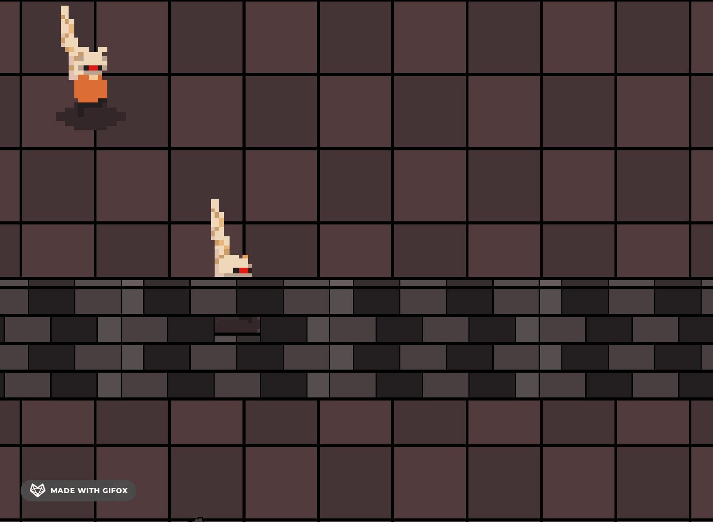

# Breakable Walls in Phaser

A demo tutorial using Phaser Graphics game object to render walls built with perspective bricks and having it smashed.

Hello, I'm embarking on a journey to launch my first game, Invasion, into the gaming world. It would be a delight if you can tag along as I break down and share different component of the game with you.

Protect your camp from the Invasion. You will have troops to summon to help you. Troops and equipment upgrades are at your disposal and with each passing level, the onslaught intensifies.

TL;DR

Each Brick is created by defining the faces of the vertices and using Graphics#lineTo to form each face (side) of the brick.

The bricks are put into multiple rows and columns to form a Wall. They are staggered and have different colors to make it visually appealing.

When a wall gets hit by the enemy, the nearest brick flies away from the angle of attack. When a wall destroyed, it gets half-ed where the enemy is standing, clearing a path forward for the enemy.

The Sprite related classes:

Spritesheet: Handles loading of animations. Since we only need to store one copy of these spritesheet in memory
PhysicsSprite - Has reference to Spritesheet, and general functionality like playing animation.
Enemy - Inherits from PhysicsSprite and has functionality that is related to enemies. Also has reference to AI behavior classes.

AI Classes:

Attribution:

Built with the fun and fast 2D HTML game framework Phaser
Character sprite is not free and requires payments from the Penusbmic
Impact sound from OpenGameArt
Wall crumbling sound from Youtube

## Requirements

[Node.js](https://nodejs.org) is required to install dependencies and run scripts via `npm`.

## Available Commands

| Command | Description |
|---------|-------------|
| `npm install` | Install project dependencies |
| `npm start` | Build project and open web server running project |
| `npm run build` | Builds code bundle with production settings (minification, uglification, etc..) into the `dist` folder |